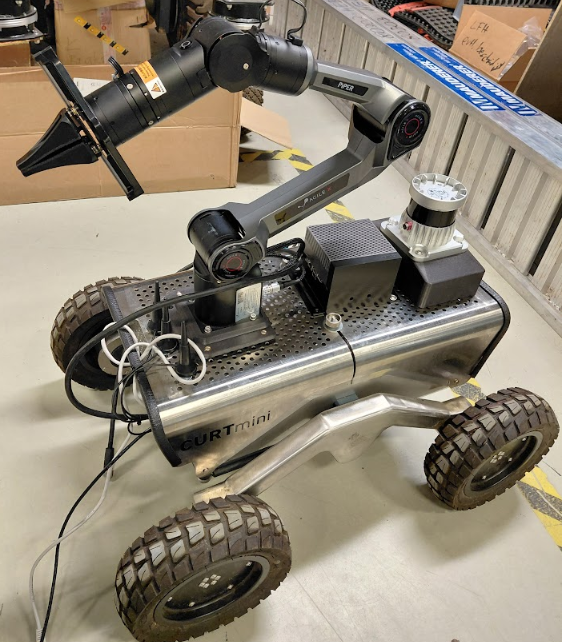
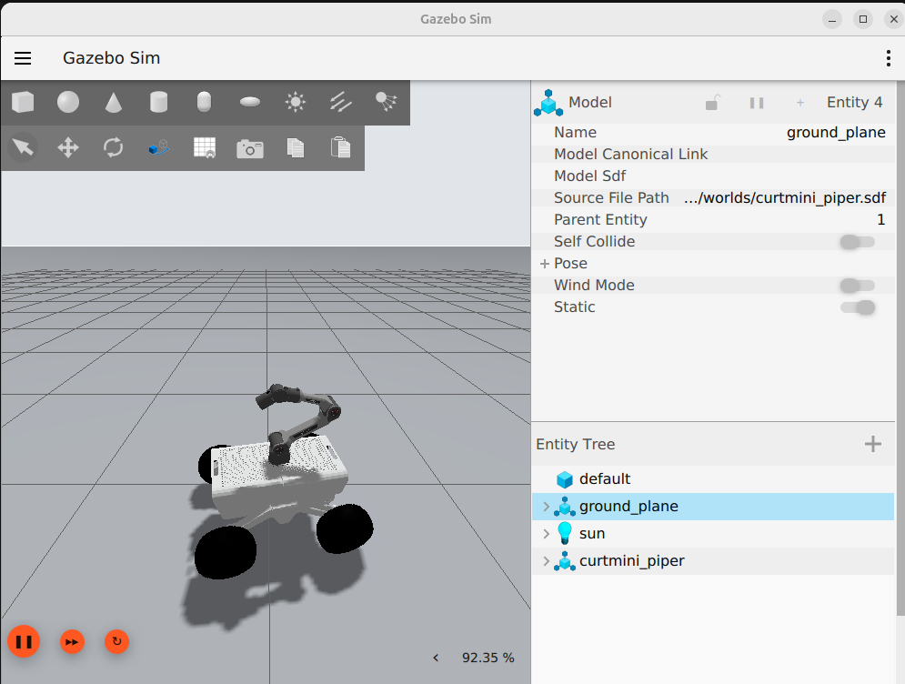

# Curt Mini with Piper Arm

Project documentation for installing and operating the Curt Mini mobile base
with an AgileX Piper arm.

| Real robot | Gazebo simulation |
| --- | --- |
|  |  |

```{toctree}
:maxdepth: 3
:caption: Contents

overview
installation/index
startup/index
troubleshooting
student_helpers/index
```
